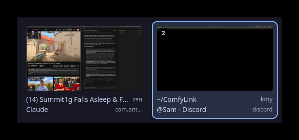

# svitek

svitek (Czech: scroll) is a workspace switcher panel for [sway](https://swaywm.org):
one resident process that pops a strip of workspace cards over the middle of the
focused output, each card a thumbnail of that workspace and the window titles on
it.

<!-- screenshot: docs/screenshot-center.png, the centered strip over a real
     session; and docs/screenshot-left.png for the column `position = "left"`
     gives. Once they exist, drop the comment and use:
      -->

## What it does

* `$mod+Tab` — or whatever you bind `svitek toggle` to — toggles the panel. It
  appears in the middle of the output that has focus, and lists the workspaces
  of that output only — one card per workspace, side by side,
  `[ws1] [ws2] [ws3]`, where the eyes already are. If there are more
  workspaces than fit across the screen the strip scrolls sideways rather
  than shrinking the thumbnails. Set `position = "left"` (or `"right"`) in the
  config for the alternative: a full-height column pinned to that edge, one row
  per workspace, with room for more window titles beside each thumbnail.
* Every card (or row) shows the workspace name/number, a thumbnail of that
  workspace, and the titles of the windows on it — three of them on a card, six
  in a column row, then "+N more". The focused workspace is marked.
* **Rest the pointer on a card and that workspace appears live behind the
  panel.** After about a tenth of a second svitek switches to it and leaves the
  panel up on top, so you are looking at the real workspace, not a thumbnail —
  moving, up to date, with everything on it. Move to another card and it
  follows; move back to the one you started on and you are back where you were.
* **The scroll wheel does the same thing without the pointer.** A wheel step
  anywhere on the screen while the panel is up — a card, the panel itself, or
  the empty space around it — moves the selection one workspace along (wheel
  down: to the right in the centered strip, down the list in a column) and
  previews it exactly like hovering does. It stops at the first and last
  workspace instead of wrapping, and it follows the pointer: scroll after
  hovering a card and the next step counts from *that* one. Spin it through
  five workspaces and svitek switches once, when you stop, not five times on
  the way; if the strip or list is bigger than the screen it scrolls to keep
  the selection in view.
* **Click a workspace to go to that workspace: the panel closes and you are there.**
  That is what picking one means, so the click that picks it also puts the panel
  away. `Enter` does the same for the workspace you have selected with the wheel
  (or are hovering). If you would rather use the panel to walk through several
  workspaces in one showing, set `close_on_select = false`: a click then switches
  but leaves the panel up, the focus marker moves to that card or row, and previews start
  from there — `Enter` still closes. `Esc`, the toggle key again, or a click
  anywhere outside the panel hides it and **puts you back on the active
  workspace** — the one you opened it from, or, with `close_on_select = false`, the last one you
  clicked — whatever you previewed in between. So looking around costs nothing,
  and the only way to end up somewhere new is to click a workspace or press `Enter`.
  That dismissing click is swallowed: svitek's surface covers the whole output,
  so closing the panel never also clicks the window behind it. The catch on a
  multi-output setup is that the surface covers only the output the panel is on
  — a click on another screen does not close the panel (it does move sway's
  focus there); `Esc` and the toggle key work from anywhere.
* **`mode = "hold"` turns all of that into alt-tab.** With it, the key that
  opens the panel keeps working while the panel is up: every further press
  steps the selection one workspace on — round to the first again after the
  last, because a key you tap repeatedly is a cycle — and **letting go of the
  modifier commits**, exactly as `Enter` does. Nothing else changes: hovering,
  the wheel, `Enter`, clicks, `Esc` and a click outside all mean what they mean
  in the default `toggle` mode. `svitek next` and `svitek prev` do the same
  stepping in both modes, so `$mod+Shift+Tab` can walk backwards.
* A preview is a **real workspace switch** — sway renders only the workspace it
  is showing, so there is no other way to see one live. That means sway fires
  its usual `workspace` events for every preview, and anything watching them
  sees the visits: sway's own `workspace back_and_forth`, and any
  workspace-history tool, will remember the workspaces you hovered past, not
  just the one you picked. svitek cannot hide that — a preview you could not
  observe would not be a preview. (Its own commands do pass
  `--no-auto-back-and-forth`, so a switch to the workspace you are already on is
  a no-op instead of a jump back somewhere else.) If your workspace history ever
  looks busier than your day was, this is why.
* Toggling is a socket round trip to the already-running process — no cold
  start, no new window. Measured against the headless test sway on software
  rendering (pixman): `svitek toggle` returns in ~15 ms, nearly all of it
  spawning the client process; the daemon has the panel up a couple of
  milliseconds after the command reaches it (it first takes one fresh
  screencopy of the current workspace, ~1.5 ms); and the pixels are on screen
  ~35 ms after the toggle, ~65 ms on the very first, cold one — well under
  100 ms either way.

## The thumbnail compromise — read this before filing a bug

Sway renders only the *visible* workspace of each output. There is no way to ask
it for a live picture of a workspace you are not looking at; that image simply
does not exist anywhere. Hovering a row is the way around that — it makes the
workspace visible for real — but the little pictures in the list cannot be:

* While the panel is hidden, svitek keeps a throttled screencopy request per
  output (at most one frame every ~400 ms, and none at all when nothing
  repaints). Each frame is filed under whichever workspace was visible on that
  output at that moment.
* So the preview of a workspace you are *not* on is **the last frame captured
  while you were still on it** — typically a fraction of a second before you
  left. It does not update afterwards. A video playing on another workspace
  shows as a frozen frame; a window that appeared there since you left is not
  in the picture.
* When you leave a workspace its cached frame is already fresh; when you enter
  one it is re-captured ~150 ms later, once sway has drawn it; and on toggle the
  current workspace is captured fresh before the panel appears.
* Captures are paused while the panel is up, so the panel never appears inside
  a thumbnail. A workspace you preview by hovering therefore keeps its old
  thumbnail until the panel closes; you are looking at the live thing behind the
  panel anyway.
* A workspace you have not visited since svitek started has no frame at all and
  shows a "no preview yet" placeholder with the window titles.
* The cache lives in memory only. Restart svitek and every thumbnail is gone
  until you visit the workspaces again.

This is a deliberate compromise, not a bug.

## Build & install

Build dependencies: a Rust toolchain (stable), `pkg-config`, and the
development packages of gtk4 ≥ 4.18 and gtk4-layer-shell ≥ 1.3 — on Arch that
is `gtk4 gtk4-layer-shell`, on Debian/Ubuntu `libgtk-4-dev` and
`libgtk4-layer-shell-dev`.

```sh
cargo install --path .          # into ~/.cargo/bin
```

or, if you would rather place the binary yourself:

```sh
cargo build --release
cp target/release/svitek ~/.local/bin/
```

`tools/inject/` is a test-only crate with its own `Cargo.toml`, deliberately
not part of this package: `cargo build` here never builds it (see
[Testing](#testing)).

Runtime dependencies: gtk4 ≥ 4.18, gtk4-layer-shell ≥ 1.3, and sway — svitek
speaks sway's IPC and nothing else, and is tested on sway 1.12. It also needs
`wlr-screencopy-unstable-v1`, which sway provides; without screencopy svitek
refuses to start, because thumbnails are the whole point.

## Sway config

```
exec svitek
bindsym $mod+Tab exec svitek toggle
bindsym $mod+Shift+Tab exec svitek prev
```

Any key will do — `$mod+Tab` is only the one this was written for. If you
prefer `$mod+a`, note that it is `focus parent` in sway's default config: the
last `bindsym` for a key wins, so put the svitek binding *after* the defaults
(after any `include`), or move `focus parent` somewhere else.

For the alt-tab shape of the same thing, set `mode = "hold"` in the config and
keep the bindings above — a modifier you hold, plus a key you tap.

Hold `$mod`, tap `Tab` to open the panel with the next workspace already
selected (so a quick tap is a switch, the way alt-tab is), tap it again for each
further workspace, and let go of `$mod` to land there. Set
`hold_selects_next = false` if you would rather the first press only opened the
panel. Sway resolves the binding itself, so the panel never sees the `Tab` at
all — every press arrives as another `svitek toggle`, which in this mode means
"one workspace on" rather than "close". Any of Super, Alt, Ctrl, Meta or Hyper
works as the held key (Shift does not count, so `$mod+Shift+Tab` can go
backwards without committing when you let Shift go).

## Commands

| command | what it does |
|---|---|
| `svitek` | run the panel daemon (put `exec svitek` in your sway config) |
| `svitek toggle` | show the panel, or hide it if it is up |
| `svitek show` / `svitek hide` | show the panel / hide the panel |
| `svitek next` | show the panel, or step the selection one workspace on (wrapping) and preview it |
| `svitek prev` | the same, one workspace back |
| `svitek quit` | stop the running daemon |
| `svitek --help` / `svitek --version` | print the usage text / the version, and exit |

`--help` and `--version` are answered by the client itself. Every other
argument is a one-line message to the running daemon; if none is running the
client says so and exits 1.

## Configuration

`~/.config/svitek/config.toml` (strictly `$XDG_CONFIG_HOME/svitek/config.toml`).
The file is optional; so is every key in it. An unknown key or a syntax error is
reported on stderr at start and the defaults are used.

```toml
# Width of the thumbnails in pixels; height follows the output's aspect ratio.
# In the centered layout this is also the width of a card. (clamped to 80–1000)
thumbnail_width = 240
# Where the panel sits: "center" (default) is a horizontal strip of cards in the
# middle of the output; "left" and "right" are a full-height column pinned to
# that edge.
position = "center"
# Close the panel as soon as a workspace is clicked (default); `false` switches
# but leaves it open, so several workspaces can be visited. Enter always closes.
close_on_select = true
# What the key bound to `svitek toggle` does. "toggle" (default) is a switch:
# press to open, press again to close. "hold" is alt-tab: while the panel is up
# every further press steps the selection one workspace on (wrapping), and
# releasing the modifier commits it. See "Sway config" above for the bindings.
mode = "toggle"
# Hold mode only. true (default): the press that opens the panel already selects
# the *next* workspace, like alt-tab — a quick tap switches. false: the first
# press only opens the panel and the selection stays where you are.
hold_selects_next = true

[colors]
background = "#1e1e2ecc"   # panel background (RGBA hex allowed)
foreground = "#cdd6f4"     # window titles
dim        = "#a6adc8"     # app_id, workspace labels
focused    = "#89b4fa"     # border/marker of the focused workspace card
                           # (the one being previewed gets the same colour at 60 %)
```

## Environment

* `RUST_LOG` — log level of the daemon, e.g. `RUST_LOG=svitek=debug svitek`.
* `SVITEK_SOCKET` — override the control socket path (default
  `$XDG_RUNTIME_DIR/svitek.sock`, or `/tmp/svitek-<uid>.sock` if
  `XDG_RUNTIME_DIR` is unset). Both the daemon and the client read it, so it is
  the way to run a second svitek against a second (e.g. nested or headless)
  sway without the two fighting over one socket.
* `SWAYSOCK` — which sway svitek talks to. swayipc reads `I3SOCK` first, and a
  shell pointed at a nested sway usually still carries the outer session's
  `I3SOCK`, so svitek copies `SWAYSOCK` over `I3SOCK` as the first thing it
  does (near the top of `main` in `src/main.rs`). Setting `SWAYSOCK` is
  therefore enough to aim it at a particular compositor.

## Testing

Never test svitek against the sway session you are working in — a panel that
grabs the keyboard while it is half-implemented is unpleasant to escape.
`tests/headless-sway.sh` starts a nested headless sway with two outputs for
exactly this:

```sh
export SVITEK_SOCKET=$XDG_RUNTIME_DIR/svitek-test.sock
eval "$(tests/headless-sway.sh start)"   # exports SWAYSOCK, WAYLAND_DISPLAY, SVITEK_TEST_DIR
cargo run                                # against the headless sway only
tests/headless-sway.sh stop
```

Two variables have to be exported *before* `start`, because the script reads
them while it writes the nested sway's config:

* `SVITEK_TEST_DIR` — where that config, the sway log and the pid file go
  (default `$XDG_RUNTIME_DIR/svitek-test`). Export your own to keep parallel
  headless instances apart; the script echoes the value back among the exports
  either way, so `stop` finds the same directory. `start` refuses to run if a
  test sway is already live there, and `stop` only kills a process that really
  is that sway. `tests/e2e.sh` wipes the directory before each run, so there it
  must be an absolute path whose last component starts with `svitek-` (the
  default is `$XDG_RUNTIME_DIR/svitek-e2e-<pid>`).
* `SVITEK_BIN` — path to a svitek binary. With it set, the generated config
  gets a real `bindsym $mod+Tab exec <it> toggle` (and `$mod+Shift+Tab` for
  `prev`), so hold mode can be driven through sway's own key handling rather
  than through the control socket. Sway's `exec` inherits sway's
  environment, so `SVITEK_SOCKET` must be exported before `start` too for that
  binding to reach the test daemon.

The unit tests (`cargo test`) need no compositor at all.

`tests/e2e.sh` does the whole thing unattended — headless sway, build, daemon,
toggle/show/hide/quit, the 1 → 2 → back-to-1 thumbnail check (a pixel test on
the preview), a click on a row in both `close_on_select` modes and, with the
daemon restarted on the default config, the centered strip (where its focus
marker lands on screen, a click outside it, a wheel step to the next card) and,
with `mode = "hold"`, the whole alt-tab gesture driven through a real
`bindsym $mod+Tab` in the nested sway (stepping, wrapping, `next`/`prev`,
committing on the release of Super, and the race where Super is already up
before the panel maps) — and exits non-zero if anything fails. It builds the
crate itself, so the build dependencies above apply on top of: `sway`, `foot`,
`grim`, `setsid` (util-linux), `xkbcli` (libxkbcommon-tools — the injector
compiles the virtual keyboard's keymap with it), and either python3 + PIL or
ImageMagick 7 for the pixel checks (the binary is called `magick`; version 6's
`convert` is not used). `tools/inject/` is a separate test-only crate that
fakes pointer motion, clicks, wheel steps and key presses on the headless seat,
which has no input devices; see the comment at the top of
`tools/inject/src/main.rs`.

The e2e test does not run on GitHub-hosted CI: it needs a compositor — sway
itself, plus the Wayland stack and the tools above — which the hosted runners
do not provide. `cargo test`, `cargo fmt --check` and `cargo clippy` are the
parts that can run there.

## Non-goals (v0)

No drag and drop of windows between workspaces, no reordering of workspaces, no
layout control, no compositors other than sway, no animations. Ideas that keep
coming back live in `TODO.md`; the design rationale lives in `DESIGN.md`.

## License

MIT — see [LICENSE](LICENSE).
